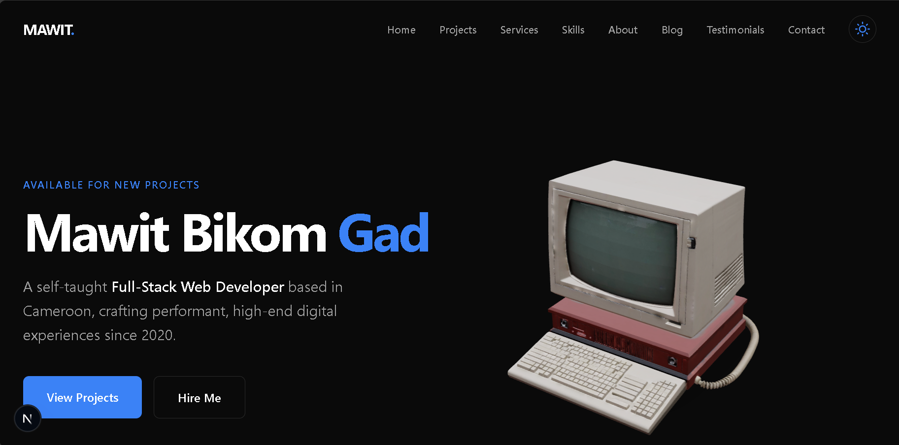

# Mawit Bikom Gad - Portfolio

A high-performance, dynamic portfolio website built with Next.js 15, TypeScript, and Tailwind CSS. This project leverages the Notion API for project management, Hashnode GraphQL for blogging, and EmailJS for client-side contact form handling.



## 🚀 Features

-   **Dynamic Projects**: Fetched natively from a Notion Database.
-   **Dynamic Blog**: Integrated with Hashnode's GraphQL API.
-   **Client-Side Contact Form**: Powered by EmailJS, no backend required.
-   **Performance Optimized**: Uses `next/image` for responsive images and WebP/AVIF support.
-   **Dark Mode**: System-aware theme toggling.
-   **Responsive Design**: Mobile-first architecture using Tailwind CSS.
-   **Animations**: Smooth transitions with Framer Motion.
-   **3D Elements**: Interactive 3D model using React Three Fiber.
-   **SEO Ready**: Fully configured metadata, OpenGraph, and Twitter cards.

## 🛠️ Tech Stack

-   **Framework**: [Next.js 15 (App Router)](https://nextjs.org/)
-   **Language**: [TypeScript](https://www.typescriptlang.org/)
-   **Styling**: [Tailwind CSS v4](https://tailwindcss.com/)
-   **CMS**: [Notion API](https://developers.notion.com/) (Projects/Testimonials)
-   **Blog Source**: [Hashnode GraphQL API](https://hashnode.com/)
-   **Email Service**: [EmailJS](https://www.emailjs.com/)
-   **Icons**: [React Icons](https://react-icons.github.io/react-icons/)
-   **3D**: [Three.js](https://threejs.org/) & [React Three Fiber](https://docs.pmnd.rs/react-three-fiber)

## 📦 Getting Started

### Prerequisites

-   Node.js 18+ installed.
-   npm or yarn or pnpm.

### 1. Clone the repository

```bash
git clone https://github.com/mawitGad/portfolio_v1.git
cd portfolio_v1
```

### 2. Install dependencies

```bash
npm install
```

### 3. Environment Variables

Create a `.env` file in the root directory and add the following keys.

**Notion Integration:**
```env
NOTION_API_KEY=secret_your_notion_integration_key
NOTION_DATABASE_ID=your_projects_database_id
TESTIMONIES_DATABASE_ID=your_testimonials_database_id
```

**Hashnode Integration:**
```env
NEXT_PUBLIC_HASHNODE_HOST=mawit.hashnode.dev
```

**EmailJS Integration:**
```env
NEXT_PUBLIC_EMAILJS_SERVICE_ID=your_service_id
NEXT_PUBLIC_EMAILJS_TEMPLATE_ID=your_template_id
NEXT_PUBLIC_EMAILJS_PUBLIC_KEY=your_public_key
```

### 4. Run the development server

```bash
npm run dev
```

Open [http://localhost:3000](http://localhost:3000) with your browser to see the result.

## 🚀 Deployment

The easiest way to deploy your Next.js app is to use the [Vercel Platform](https://vercel.com/new?utm_medium=default-template&filter=next.js&utm_source=create-next-app&utm_campaign=create-next-app-readme).

1.  Push your code to GitHub.
2.  Import project into Vercel.
3.  Add all the Environment Variables in the project settings.
4.  Deploy!

## 📄 License

This project is open source and available under the [MIT License](LICENSE).
